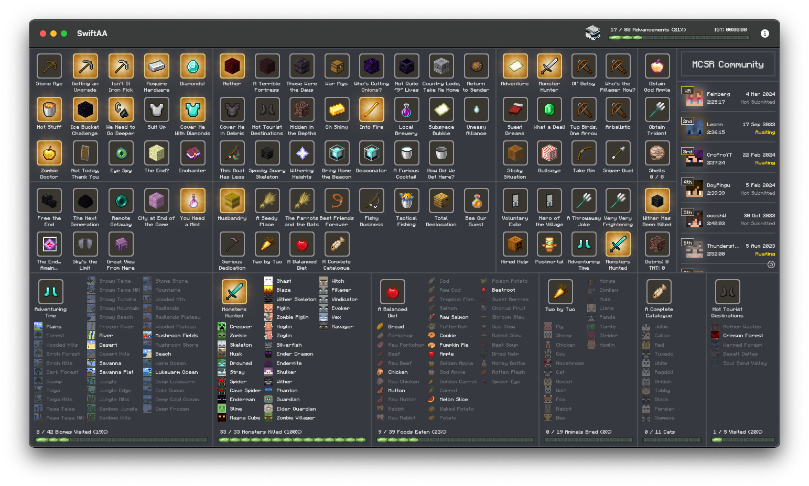
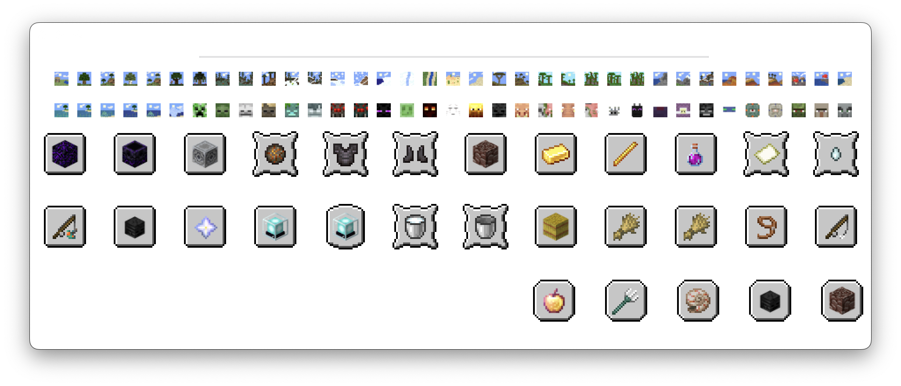

# Download → [SwiftAA for macOS](https://github.com/Kihron/SwiftAA/releases/latest/)
# Tutorial → [SwiftAA Setup Guide](https://youtu.be/rrWwdvWQdVU)

# What is SwiftAA?
SwiftAA is an app that was heavily inspiried by and utilizes assets from [CTM's AATool for Windows](https://github.com/DarwinBaker/AATool) and is designed to track the completion status
of advancements for Minecraft. It was designed to match the familiar feel of macOS and remain incredibly light weight so that anyone can use it, whether
you are a casual player or a professional speed runner. 

At the moment, only two versions are supported, 1.16 and 1.19. More versions will be added in the future.
