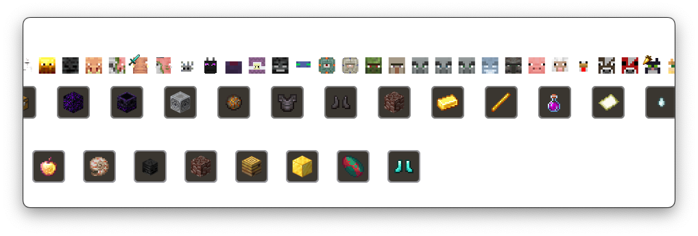

# Download → [SwiftAA for macOS](https://github.com/Kihron/SwiftAA/releases/latest/)
# Tutorial → [SwiftAA Setup Guide](https://youtu.be/rrWwdvWQdVU)

# What is SwiftAA?
SwiftAA is an app that was heavily inspired by and utilizes assets from [CTM's AATool for Windows](https://github.com/DarwinBaker/AATool) and is designed to track the completion status of advancements for Minecraft. It was designed to match the familiar feel of macOS and remain incredibly light weight so that anyone can use it, whether
you are a casual player or a professional speed runner. 

At the moment, SwiftAA supports versions 1.16, 1.19, and 1.20. More versions will be added in the future.

# How It Works
Just like CTM's AATool, SwiftAA only refreshes its data whenever Minecraft saves. This occurs every five minutes when the game autosaves, but it **can also be manually triggered by pausing and unpausing the game**. When Minecraft saves, all of the advancement and statistics are written to JSON files. SwiftAA reads those files and elegantly displays their information to you, the user.

Additionally, SwiftAA includes a built-in auto-update system. Users can opt into this feature within the settings or choose to be prompted to install updates when new versions are available. This ensures that they always have the latest version of the tracker without needing to manually download updates.
